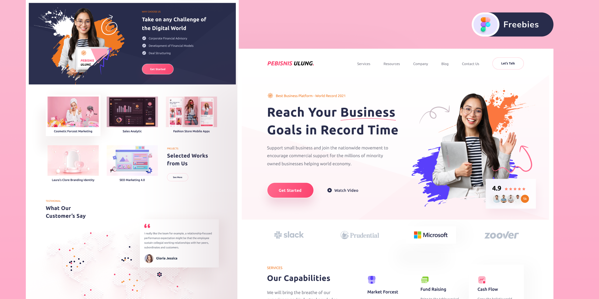

# pebisnis-ulung-tpl

This template is created using my own CSS micro-framework. Please note that the framework is not open-sourced at the moment, so you won't be able to run this project on your computer directly.

However, you can still check out the live demo of this template by visiting the following link: [Demo Link](https://pts-tpl.github.io/pebisnis-ulung-tpl/).

## Source
* [Business Agency Website](https://www.figma.com/community/file/1047428828508162425)
* Designer: Rizal Gradianto

Feel free to explore the template and its features in the live demo.
